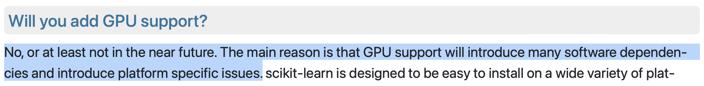

title: Scikit-learn on GPUs with Array API
use_katex: False
class: title-slide

# Scikit-learn on GPUs with Array API


.larger[Thomas J. Fan]<br>
<a href="https://www.github.com/thomasjpfan" target="_blank" class="title-link"><span class="icon icon-github right-margin"></span>@thomasjpfan</a>
<a class="this-talk-link", href="https://github.com/thomasjpfan/pydata-nyc-2023-scikit-learn-array-api" target="_blank">github.com/thomasjpfan/pydata-nyc-2023-scikit-learn-array-api</a>

---

# GPU support in scikit-learn ⁉️


---

# Historical Stance 📖



[https://scikit-learn.org/stable/faq.html#will-you-add-gpu-support](https://scikit-learn.org/stable/faq.html#will-you-add-gpu-support)

---


<br>

[https://skorch.readthedocs.io/en/stable](https://skorch.readthedocs.io/en/stable)

---

# scikit-learn v1.2 Array API support (2022)


---

# scikit-learn v1.3 Array API support (2023)


---

.g.g-middle[
.g-6.larger[
# Contents
### 1. scikit-learn API 🖥️
### 2. Array API Standard 🔬
### 3. Challenges 🚧
]
.g-6.g-center[

]
]

---

class: chapter-slide

# scikit-learn API 🖥️

---

# scikit-learn API 🖥️

```python
from sklearn.discriminant_analysis import LinearDiscriminantAnalysis

lda_np = LinearDiscriminantAnalysis()
lda_np.fit(X_np, y_np)

y_pred_np = lda_np.predict(X_np)
type(y_pred_np)
# <class 'numpy.ndarray'>
```

---


# Enabling Array API support in scikit-learn
## Global configuration 🌎

```python
import sklearn
import torch

*sklearn.set_config(array_api_dispatch=True)

X_torch_cpu, y_torch_cpu = torch.asarray(X_np), torch.asarray(y_np)

lda = LinearDiscriminantAnalysis()
lda.fit(X_torch_cpu, y_torch_cpu)

type(lda.predict(X_torch_cpu))
# <class 'torch.Tensor'>
```

---

# Enabling Array API support in scikit-learn
## Context Manager 🎬

```python
import sklearn

*with sklearn.config_context(array_api_dispatch=True):
    X_torch_cuda = torch.asarray(X_np, device="cuda")
    y_torch_cuda = torch.asarray(y_np, device="cuda")

    lda = LinearDiscriminantAnalysis()
    lda.fit(X_torch_cuda, y_torch_cuda)

    type(lda.predict(X_torch_cuda))
    # <class 'torch.Tensor'>
```

---

# Performance 🚀

.center[

]

.footnote.smaller[
16-core AMD 5950x CPU and Nvidia RTX 3090 GPU
]

---

# Incremental Support (v1.3)


[https://scikit-learn.org/stable/modules/array_api.html](https://scikit-learn.org/stable/modules/array_api.html)

---

# scikit-learn Nightly Build 🌕

.center[

]

[https://scikit-learn.org/dev/modules/array_api.html](https://scikit-learn.org/stable/modules/array_api.html)

---

class: chapter-slide

# Array API Standard 🔬

---

class: center

# Array Libraries


---

# Consortium for Python Data API Standards


[https://data-apis.org](https://data-apis.org)

---

# Array API Standard 🔬


[https://data-apis.org/array-api/latest/API_specification/index.html](https://data-apis.org/array-api/latest/API_specification/index.html)

---

.g.g-middle[
.g-6[
# Extensions 🔌
- [Linear Algebra](https://data-apis.org/array-api/latest/extensions/linear_algebra_functions.html)
- [Fourier Transforms](https://data-apis.org/array-api/latest/extensions/fourier_transform_functions.html)
]
.g-6.g-center[

]
]

---

class: top
<br><br><br>

# Vision 🔮

## NumPy Code
```python
def func(x, y):
    out = np.mean(x, axis=0) - 2 * np.std(y, axis=0)
    return out
```

--

## Array API Code
```python
def func(x, y):
    xp = array_namespace(x, y)
    out = xp.mean(x, axis=0) - 2 * xp.std(y, axis=0)
    return out
```

---

# Array API support (2022)

.g.g-middle[
.g-6[
.center[
## ✅
]
```python
import numpy.array_api as xp
import cupy.array_api as xp
```
.center[
## 🛑
]
```python
import numpy as np
import cupy as cp
```
]
.g-6.g-center[

]
]

---

# scikit-learn v1.2 Array API support (2022)

```python
import cupy
import cupy.array_api as xp

sklearn.set_config(array_api_dispatch=True)

*X_cp, y_cp = cupy.asarray(...), cupy.asarray(...)
*X_xp, y_xp = xp.asarray(X_cp), xp.asarray(y_cp)

lda = LinearDiscriminantAnalysis()
lda.fit(X_xp, y_xp)
```

---

# Meta + Quansight Collaboration


---

# `array_api_compat` 🚀
## Extend Array API standard to the main namespace!


[https://github.com/data-apis/array-api-compat](https://github.com/data-apis/array-api-compat)

---

class: top

<br>

# Using `array_api_compat` 🚀

```python
from array_api_compat import array_namespace

def func(x, y):
    xp = array_namespace(x, y)
    out = xp.mean(x, axis=0) - 2 * xp.std(y, axis=0)
    return out
```

--

<br>

## Works with 🎯

.g[
.g-6[
## `array_api_compat` Extend:
- NumPy's `ndarray`
- CuPy's `ndarray`
- PyTorch's `Tensors`
]
.g-6[
## Array API implementations
- Numpy Arrays from `numpy.array_api`
- CuPy Arrays from `cupy.array_api`
]
]

---

# scikit-learn v1.3 Array API support (2023)

```python
import torch

sklearn.set_config(array_api_dispatch=True)

*X_torch_cpu, y_torch_cpu = torch.asarray(...), torch.asarray(...)

lda = LinearDiscriminantAnalysis()
lda.fit(X_torch_cpu, y_torch_cpu)
```

---

class: chapter-slide

# Challenges 🚧

---

.g.g-middle[
.g-6[
# Challenges 🚧
- API Differences 🔌
- Semantic Differences 🪄
- Compiled Code 🏗️
]
.g-6.g-center[

]
]
---

class: chapter-slide

# API Differences 🔌

---

class: top
<br><br><br>

# Most methods are in the module 📦

## NumPy

```python
import numpy as np

x_sum = x.sum(axis=0)
```

--

## Array API
```python
from array_api_compat import array_namespace

xp = array_namespace(x)
x_sum = xp.sum(x, axis=0)

```

---

class: top
<br><br><br>

# Most methods are in the module 📦

## NumPy
```python
import numpy as np

y = (X.mean(axis=1) > 1.0).any()
```

--

## Array API
```python
xp = array_namespace(x)

y = xp.any(xp.mean(X, axis=1) > 1.0)
```

---

class: top
<br><br>

# Matrix Multiplication 🧮

## NumPy
```python
import numpy as np

C = np.dot(A, B)
```

--

## Array API
- `@` is more restrictive compared to `np.dot`

```python
C = A @ B
```

---

class: top
<br><br>

# Differences between NumPy and Array API 🎛️

## NumPy
```python
import numpy as np

uniques = np.unique(x)
uniques, counts = np.unique(x, return_counts=True)
```

--

## Array API
```python
xp = array_namespace(x)

uniques = xp.unique_values(x)
counts = xp.unique_counts(x)
```

---

# Some NumPy API does not exist in Array API 🎚️
## NumPy
```python
import numpy as np

x_mean = np.nanmax(x, axis=1)
```

---

# Some NumPy API does not exist in Array API 🎚️
## Array API

```python
def xp_nanmax(X, axis=None):
    xp = array_namespace(X)
    if is_numpy_namespace(xp):
        return xp.asarray(numpy.nanmax(axis=axis))

    # Implement using Array API standard (simplified)
    mask = xp.isnan(X)
    inf_ = xp.asarray(-xp.inf, device=device(X))
    X_nanmax = xp.max(xp.where(mask, inf_, X), axis=axis)
    return X_nanmax
```

---

class: top

# Integer Indexing 🔎
## NumPy
```python
import numpy as np

x = np.asarray([[1, 2], [4, 5], [4, 1]])

x[[0, 2]]
# array([[1, 2],
#        [4, 1]])
```

--

## Array API
- Added in the `2022.12` standard

```python
import numpy.array_api as xp

x = xp.asarray([[1, 2], [4, 5], [4, 1]])

xp.take(x, xp.asarray([0, 2]), axis=0)
# Array([[1, 2],
#        [4, 1]], dtype=int64)

```

---

class: top

# Indexing Multiple Dimensions 🔎
## NumPy
```python
import numpy as np

x = np.asarray([[1, 2, 3], [4, 5, 6]])

x[1]
# array([4, 5, 6])
```
--


## Array API
```python
import numpy.array_api as xp

x = xp.asarray([[1, 2, 3], [4, 5, 6]])

x[1]
# IndexError
```

--

```python
x[1, :]
# array([4, 5, 6])
```

---

class: top
<br>

# Random Number Generators 🎮

## NumPy
```python
import numpy as np

rng = np.random.default_rng()
x = rng.standard_normal(size=10)
```

--

## Array API
```python
import numpy as np

rng = np.random.default_rng()
x_np = rng.standard_normal(size=10)

xp = array_namespace(x)
x_xp = xp.asarray(x_np, device=device(x))
```

---

# Order ♟️

```python
rng = np.random.default_rng()
x = rng.standard_normal(size=(10_000, 10_000))

*x_c = np.asarray(x, order="C")
*x_f = np.asarray(x, order="F")

%%timeit
_ = x_c.sum(axis=0)
# 36.3 ms ± 1.44 ms per loop

%%timeit
_ = x_f.sum(axis=0)
# 18.8 ms ± 131 µs per loop
```

---

# API Differences


[https://numpy.org/doc/stable/reference/array_api.html](https://numpy.org/doc/stable/reference/array_api.html)

---

class: chapter-slide

# Semantic Differences 🪄

---

class: top
<br>

# Type Promotion ♛
## NumPy
```python
import numpy as np

x1 = np.asarray([[1, 2], [4, 5]])
x2 = np.asarray([[1, 2]], dtype=np.float32)

x1 + x2
# array([[2., 4.],
#        [5., 7.]])
```

--

## Array API
```python
x1 = xp.asarray([[1, 2], [4, 5]])
x2 = xp.asarray([[1, 2]], dtype=xp.float32)

x1 + x2
# TypeError: int64 and float32 cannot be type promoted together
```

---

# Type Promotion ♛
## Workaround

```python
*x1 = xp.asarray([[1, 2], [4, 5]], dtype=xp.float32)
x2 = xp.asarray([[1, 2]], dtype=xp.float32)

x1 + x2
# Array([[2., 4.],
#        [5., 7.]], dtype=float32)
```

---

class: top

# Type Promotion ♛: Python Scalars
## NumPy
```python
import numpy as np

x1 = np.asarray([[1, 2, 3]])
x2 = 1.0

x1 + x2
# array([[2., 3., 4.]])
```

--

## Array API
```python
import numpy.array_api as xp

x1 = xp.asarray([[1, 2, 3]])
x2 = 1.0

x1 + x2
# TypeError: Python float scalars can only be promoted with floating-point arrays.
```

---

# Type Promotion ♛: Python Scalars
## Workaround

```python
import numpy.array_api as xp

*x1 = xp.asarray([[1, 2, 3]], dtype=xp.float32)
x2 = 1.0

x1 + x2
# Array([[2., 3., 4.]], dtype=float32)
```

---

class: top
<br><br>

# Device 📠
## NumPy

```python
import numpy as np

y = np.linspace(2.0, 3.0, num=10)
```

--

## Array API
```python
from array_api_compat import device

xp = array_namespace(x)
*y = xp.linspace(2.0, 3.0, num=10, device=device(x))
```

---

class: chapter-slide

# Compiled Code 🏗️

---

# Complied Code in scikit-learn? 🏗️

- Random Forest 🌲🌲🌲
    - `RandomForestClassifier`
    - `RandomForestRegressor`
- Histogram Gradient Boosting 🎄 + 🛹
    - `HistGradientBoostingClassifier`
    - `HistGradientBoostingRegressor`
- Linear Models 📈
    - `LogisticRegression`
    - `PoissonRegressor`

---

class: top
<br><br><br>

# Possible Solutions

## Works Now 🪄

- Convert to NumPy and back - SciPy

--

## Future 🔮

- [uarray](https://uarray.org/en/latest/) - SciPy
- Plugins - Scikit-learn
- Array library specific code

---

# Convert to NumPy and back - SciPy

```python
def func(a, b):
    xp = array_namespace(a, b)
    c = xp.sum(a, axis=1) + xp.sum(b, axis=1)

*   c = numpy.asarray(c)
*   d = compiled_code_that_only_works_with_numpy(c)
*   d = xp.asarray(d)

    return d
```

---

# Array library specific code 📚

```python
def erf(x):
    if is_numpy(x):
        import scipy.special
        return scipy.special.erf(x)

    elif is_cupy(x):
        import cupyx.scipy.special.erf
        import cupyx.scipy.special.erf(x)

    elif is_pytorch(x):
        import torch
        return torch.special.erf(x)

    else:
        ...
```

---

.g.g-middle[
.g-6[
# Challenges 🚧
- API Differences 🔌
- Semantic Differences 🪄
- Compiled Code 🏗️
]
.g-6.g-center[

]
]
---

# Why Adopt the Array API Standard?

.g.g-center[
.g-4[
## Smaller API

]
.g-4[
]
.g-4[
]
]

---

# Why Adopt the Array API Standard?

.g.g-center[
.g-4[
## Smaller API

]
.g-4[
## Portable

]
.g-4[
]
]

---

# Why Adopt the Array API Standard?

.g.g-center[
.g-4[
## Smaller API

]
.g-4[
## Portable

]
.g-4[
## Performance

]
]

---

class: center


---

# SciPy


[https://scipy.github.io/devdocs/dev/api-dev/array_api.html](https://scipy.github.io/devdocs/dev/api-dev/array_api.html)

---

class: top

# Conclusion

.g.g-middle[
.g-8[
## User 🧪
- Try scikit-learn's Array API feature support
    - [https://scikit-learn.org/stable/modules/array_api.html](https://scikit-learn.org/stable/modules/array_api.html)

## Library Author ✍️
- Try using the Array API standard
    - Issue tracker: [https://github.com/data-apis/array-api](https://github.com/data-apis/array-api)
]
.g-4[

]
]

--

<br>
.center[
.larger[Thomas J. Fan]<br>
<a href="https://www.github.com/thomasjpfan" target="_blank" class="title-link"><span class="icon icon-github right-margin"></span>@thomasjpfan</a>
<a class="this-talk-link", href="https://github.com/thomasjpfan/pydata-nyc-2023-scikit-learn-array-api" target="_blank">github.com/thomasjpfan/pydata-nyc-2023-scikit-learn-array-api</a>

]
